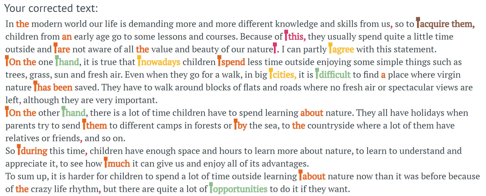

  

# heptabot – a deep learning text corrector
Powered by [Text-To-Text Transfer Transformer](https://github.com/google-research/text-to-text-transfer-transformer) model, `heptabot` is designed and built to be a practical example of a powerful user-friendly open-source error correction engine based on cutting-edge technology.

## Description
`heptabot` is trained on 4 similar but distinct tasks: *correction* (default), which is just general text paragraph-wise text correction, *jfleg*, which is sentence-wise correction based on [JFLEG](https://github.com/keisks/jfleg) competition, and *conll* and *bea*, based on [CoNLL-2014](https://www.comp.nus.edu.sg/~nlp/conll14st.html) and [BEA 2019](https://www.cl.cam.ac.uk/research/nl/bea2019st/) competitions respectively, which are also sentence-wise correction tasks, but more focused on grammar errors. While the core model of `heptabot` is T5, which performs the actual text correction for all of the described tasks, it also provides post-correction error classification for the *correction* task and uses `spaCy`'s sentence parsing output to enhance the performance on *conll* and *bea* tasks. Note that while `heptabot` should in theory be able to correct English texts of any genre, it was trained specifically on student essays and, thus, works best on them.

  

 <i>An example of text correction</i> 

## How to use
**Select a convenient way of using `heptabot` depending on your needs:**
* If you want to **quickly test basic `heptabot` with a few texts** or **see our Web version**, use [Web demo](https://lcl-correct.it/).
* If you want to **test `tiny`, CPU version of heptabot**, use [`tiny` version in Colab CPU environment](https://colab.research.google.com/github/lcl-hse/heptabot/blob/cpu/notebooks/Run_tiny_model_on_Colab_CPU.ipynb).
* If you want to **process a few texts with a more powerful `medium` version**, use [`medium` version in Colab GPU environment](https://colab.research.google.com/github/lcl-hse/heptabot/blob/gpu-tpu/notebooks/Run_medium_model_on_Colab_GPU.ipynb).
* If you want to **process a large amount (hundreds) of texts**, use [`medium` version in Colab TPU environment](https://colab.research.google.com/github/lcl-hse/heptabot/blob/gpu-tpu/notebooks/Run_medium_model_on_Colab_TPU.ipynb).
* If you want to **use our most powerful version**, use [`xxl` version in Kaggle TPU environment](https://www.kaggle.com/isikus/run-heptabot-xxl-model-on-tpu).
* If you want to **reproduce our scores**, refer to the **Measure performance** section at the end of each corresponding notebook ([`tiny`](https://colab.research.google.com/github/lcl-hse/heptabot/blob/cpu/notebooks/Run_tiny_model_on_Colab_CPU.ipynb#scrollTo=HH35ksIc5qj6), [`medium`](https://colab.research.google.com/github/lcl-hse/heptabot/blob/gpu-tpu/notebooks/Run_medium_model_on_Colab_GPU.ipynb#scrollTo=HH35ksIc5qj6), [`xxl`](https://www.kaggle.com/isikus/run-heptabot-xxl-model-on-tpu?scriptVersionId=69426878&cellId=32)).

**For cloning `heptabot` onto your hardware we suggest using our Docker images, as our former installation procedures were too complicated to follow and are now deprecated.**
* If you want to **install our CPU (`tiny`) version/clone our Web demo**, pull our [`tiny-cpu` Docker image](https://hub.docker.com/layers/lclhse/heptabot/tiny-cpu/images/sha256-030e21180f80b754b037de09b1f86f0d9d7601cdbf68782ecbf9869d6247756a): `docker pull lclhse/heptabot` (our legacy [Install](https://github.com/lcl-hse/heptabot/blob/cpu/legacy/Install.ipynb) procedure is deprecated).
* If you want to **install our GPU (`medium`) version/set up a Web version of `medium` model** (and you have a GPU), pull our [`medium-gpu` Docker image](https://hub.docker.com/layers/lclhse/heptabot/medium-gpu/images/sha256-3290267a1b9e3b4b5cac10e46ff8365e5d7ea3da3c8555e6454ede640f975048): `docker pull lclhse/heptabot:medium-gpu` (our legacy [Install](https://github.com/lcl-hse/heptabot/blob/gpu-tpu/legacy/Install.ipynb) procedure is deprecated).
* To boot the image as a Web service, use `docker run -td -p 80:5000 -p 443:5000 lclhse/heptabot "source activate heptabot; ./start.sh; bash"` and wait for around 75 seconds. In order to stop `heptabot`, just kill the container using `docker container kill $(docker container ps -q -f ancestor=lclhse/heptabot)`.
* To use the image internally, connect to it like `docker run -it lclhse/heptabot bash` or connect to an externally deployed version on e. g. [vast.ai](https://vast.ai/). Once connected to the terminal, run `source activate heptabot` and start Jupyter Lab: you will see our example notebook in the root directory. To kill `heptabot` inside the running container, you may use `kill $(lsof | grep -oP '^\S+\s+\K([0-9]+)(?=\s+(?![0-9]).*?9090)' | xargs -n1 | sort -u | xargs)`. In order to restart `heptabot` after that, use `./start.sh` or, if running in Jupyter Lab, use `prompt_run.sh` generated in the notebook.

## Performance
Here's how `heptabot` scores against state-of-the-art systems on some of the most common Grammar Error Correction tasks:
|CoNLL-2014|JFLEG|BEA 2019|
|--|--|--|
|<table> <tbody><tr><th>Model</th><th>Precision</th><th>Recall</th><th>F0.5</th></tr><tr><td><a href="https://www.aclweb.org/anthology/2020.bea-1.16/">Omelianchuk et al., 2020</a></td><td><strong>78.2</strong></td><td>41.5</td><td>66.5</td></tr><tr><td><a href="https://www.aclweb.org/anthology/2020.tacl-1.41/">Lichtarge et al., 2020</a></td><td>74.7</td><td>46.9</td><td><strong>66.8</strong></td></tr><tr style="border-top: thick solid;"><td>`heptabot`, <em>tiny</em> (CPU)</td><td>14.68</td><td>19.48</td><td>15.44</td></tr><tr><td>`heptabot`, <em>medium</em> (GPU)</td><td>70.78</td><td>46.03</td><td>63.91</td></tr><tr>  <td>`heptabot`, <em>xxl</em> (TPU)</td><td>70.36</td><td><strong>54.26</strong></td><td>66.52</td></tr></tbody> </table>| <table> <tbody><tr><th>Model</th><th>GLEU</th></tr><tr><td><a href="https://www.aclweb.org/anthology/N19-1333/">Lichtarge et al., 2019</a></td><td>63.4</td></tr><tr><td><a href="https://www.aclweb.org/anthology/2020.tacl-1.41/">Lichtarge et al., 2020</a></td><td><strong>64.9</strong></td></tr><tr style="border-top: thick solid;"><td>`heptabot`, <em>tiny</em> (CPU)</td><td>34.83</td></tr>  <tr><td>`heptabot`, <em>medium</em> (GPU)</td><td>60.81</td></tr><tr><td>`heptabot`, <em>xxl</em> (TPU)</td><td>64.57</td></tr></tbody> </table>|<table> <tbody><tr><th>Model</th><th>Precision</th><th>Recall</th><th>F0.5</th></tr><tr><td><a href="https://www.aclweb.org/anthology/2020.bea-1.16/">Omelianchuk et al., 2020</a></td><td>79.4</td><td>57.2</td><td>73.7</td></tr><tr><td><a href="https://www.aclweb.org/anthology/2020.tacl-1.41/">Lichtarge et al., 2020</a></td><td>75.4</td>  <td>64.7</td><td>73.0</td></tr><tr><td><a href="https://competitions.codalab.org/my/competition/submission/871700/detailed_results/">JackieHan, 2021</a></td><td><strong>84.87</strong></td><td>56.73</td><td><strong>77.21</strong></td></tr><tr style="border-top: thick solid;"><td>`heptabot`, <em>tiny</em> (CPU)</td><td>8.49</td><td>21.08</td><td>9.65</td></tr>  <tr><td>`heptabot`, <em>medium</em> (GPU)</td><td>68.44</td><td>62.79</td><td>67.23</td></tr><tr><td>`heptabot`, <em>xxl</em> (TPU)</td><td>70.29</td>  <td><strong>72.67</strong></td><td>70.75</td></tr></tbody> </table>|

The performance measurements for different `heptabot` versions are as follows:
| Version       | RAM load  | GPU memory load | Avg time/text (`correction`) | Avg time/symbol (`correction`) |
| ------------- | --------- | --------------- | ---------------------------- | ------------------------------ |
| `tiny`, CPU   | 2.176 GiB | -               | 11.475 seconds               | 9.18 ms                        |
| `medium`, GPU | 0.393 GiB | 14.755 GiB      | 14.825 seconds               | 11.86 ms                       |
| `medium`, TPU | 2.193 GiB | -               | 2.075 seconds                | 1.66 ms                        |
| `xxl`, TPU    | 2.563 GiB | -               | 6.225 seconds                | 4.98 ms                        |

## FAQ
* **Q: Why do you host `tiny` version and have its image as default while your other models produced better results?**
* A: While it performs worse, our `tiny` model is a working proof of concept, guaranteed to work on virtually any Unix host with 4 GiB free RAM. This version is also the best fit for our hosting capabilities, as we currently cannot afford renting a high-end GPU on-demand 24/7. However, you are more than welcome to set up a working online version of `medium` version on a GPU (in fact, we will be more than happy to hear from you if you do).

* **Q: Why no CPU version of `medium` model, GPU version of `tiny` model etc.?**
* A: There is a number of reasons.
  - It is technically possible to run our `medium` version on CPU: you may, for example, change `FROM nvidia/cuda:10.1-cudnn7-devel-ubuntu18.04` to `FROM ubuntu:18.04` at the beginning of the [Dockerfile](https://github.com/lcl-hse/heptabot/blob/gpu-tpu/Dockerfile) to get a working environment with `medium` version on CPU architecture. However, its running time will be inadequately slow: in our tests, processing 1 file took somewhere between 1m30s and 5m. As such, we do not support this version.
  - The core of our `tiny` version is a distilled `t5-small` model, which is, more importantly, quantized. Quantization is a CPU-specific technique, so quantized models cannot run on other architectures than CPUs. Hence, no GPU or TPU versions for `tiny`.
  - Likewise, our `xxl` version employs a fine-tuned version of `t5-11B` checkpoint, which is just too big for either CPU of GPU hosts (it is, in fact, too big even for `v2-8` TPU architecture available in Google Colab's instances, so we have to run it on Kaggle's `v3-8` TPUs).

* **Q: Are you planning to actively develop this project?**
* A: As of now, the project has reached a stage where we are fairly satisfied with its performance, so we plan only to maintain the existing functionality and fix whatever errors we may run into for now. This is not to say that there are no more major updates coming for `heptabot`, or, conversely, that `heptabot` will be actively maintained forever: things may change in the future.

* **Q: Can I contribute to this project?**
* A: Absolutely! Feel free to open issues and merge requests; we will process them in due time.

* **Q: How can I contact you?**
* A: Currently you can reach us at [istorubarov@edu.hse.ru](mailto:istorubarov@edu.hse.ru).

* **Q: Why is this section called FAQ if you haven't had so much of these questions prior to publishing it?**
* A: Following a [fine example](https://youtu.be/8YUWDrLazCg), in this case, "FAQ" stands for "Fully Anticipated Questions".

## Reproduce
Feel free to reproduce our research: to do so, follow the notebooks from the [retrain](https://github.com/lcl-hse/heptabot/blob/cpu/retrain/) folder. Please note that you have to get access to some of the datasets we used before obtaining them, so this portion of code is omitted.
